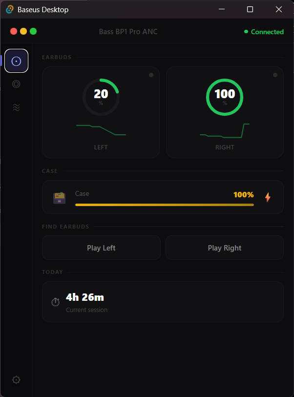

# baseus-desktop

Open-source Windows desktop client for Baseus earbuds, built by reverse-engineering
the official Baseus Android app.

**Platform:** Windows 10 1903+ (WinRT Bluetooth APIs)

## Supported hardware

| Model | Status | Battery | ANC | EQ |
|---|---|---|---|---|
| Bass BP1 Pro ANC | ✅ Verified | ✅ L/R/case | ✅ 3-mode + strength | ✅ 4 presets |
| Inspire XH1 | 🧪 Experimental | ⚠ Untested | ⚠ 5-mode adaptive (untested) | — |
| Inspire XP1 | 🧪 Experimental | ⚠ Untested | ⚠ 3-mode (untested) | ⚠ Untested |
| Inspire XC1 | 🧪 Experimental | ⚠ Untested | ⚠ 3-mode (untested) | ⚠ Untested |

**Experimental** means the protocol was extracted from the Baseus Android APK via static analysis —
no physical device has been tested. If you own any of these, install the app and
[report what works](https://github.com/elaxptr/baseus-desktop/issues). See
[docs/protocol/inspire-xh1.md](docs/protocol/inspire-xh1.md) for the full protocol draft.

## Features

- Live L / R / case battery with charge state indicators
- Session timer (time since buds connected)
- ANC mode switching (Off / Active Noise Cancellation / Transparency) with strength slider
- EQ preset selection (Balanced / Bass Boost / Voice / Clear)
- Find-my-buds (plays a tone on one earbud)
- Low-battery desktop notifications
- Launch at login



## Building

```
# Prerequisites: Rust stable, Node.js, pnpm
pnpm install
pnpm tauri build
```

Or for development with hot-reload:

```
pnpm tauri dev
```

## Protocol documentation

The reverse-engineering methodology and full packet tables live in [`docs/protocol/`](docs/protocol/).
Frida hook scripts used to capture BLE writes are in [`docs/frida/`](docs/frida/).

See [`docs/re-methodology.md`](docs/re-methodology.md) to add support for a new Baseus model —
each model is one file in `crates/baseus-protocol/src/models/`.

## Architecture

```
baseus_rebuild/
├── crates/
│   ├── baseus-protocol/   # Pure Rust: packet framing, types, per-model decoders
│   └── baseus-transport/  # WinRT BLE GATT transport
├── apps/
│   └── baseus-app/        # Tauri shell + SolidJS frontend
└── docs/
    ├── protocol/          # Packet tables and framing docs
    └── frida/             # BLE capture scripts
```

## Disclaimer

This project is not affiliated with or endorsed by Baseus. All trademarks belong to their respective owners.

## License

MIT
